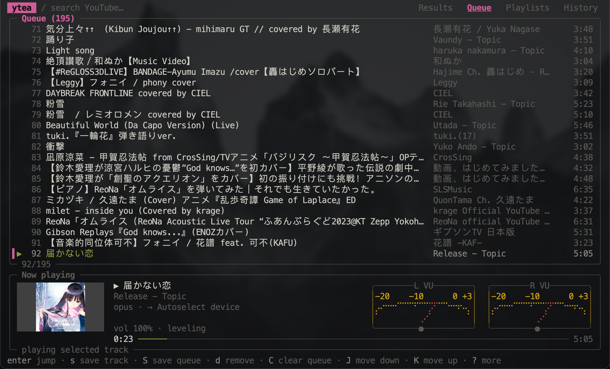

# ytea

A clean, lightweight YouTube music player for your terminal.

Stream music without opening a browser. Features an interactive queue, local playlists, album art, audio spectrum, and seamless background playback.

<p align="center">
  
</p>

<p align="center">
  
</p>

## Install

Requires [`mpv`](https://mpv.io) and [`yt-dlp`](https://github.com/yt-dlp/yt-dlp).
The visualizer needs `pw-cat` on Linux, or [`audiotee`](https://github.com/makeusabrew/audiotee) on macOS 14.2+, which your terminal must be allowed to use under System Settings → Privacy & Security → Screen & System Audio Recording. Press `v` to cycle through the spectrum, stereo VU meters, and off.
On macOS, the visualizer follows the system default output. Choosing a specific `coreaudio/<id>` output disables it because audiotee cannot capture that route.

```sh
go install -trimpath -ldflags="-s -w" github.com/omegaatt36/ytea/cmd/ytea@latest
```

## Quick Start

Launch `ytea` in your terminal:

```sh
ytea
```

- Press `/` to search YouTube, or paste any video / playlist URL directly.
- Press `enter` to play, or `a` to append to the queue.
- Press `?` anytime to open the full interactive keymap.

## Controls

| Key | Action |
|---|---|
| `/` | Search or paste URL |
| `space` | Pause / Resume |
| `←` / `→` | Seek ±5s |
| `0`–`9` | Seek to 0–90% |
| `t` | Seek to a time (`1:23`, `90`, or `50%`) |
| `n` / `p` | Next / Previous |
| `tab` | Switch pane (Results, Queue, Playlists, History) |
| `enter` | Play now |
| `a` | Add to queue |
| `s` | Save to playlist |
| `o` | Audio output device |
| `?` | Help |
| `q` | Quit |

*Mouse is also supported: click tabs, search, or list rows, use the scroll wheel to navigate, drag rows to reorder the queue and local playlists, and click the progress bar to seek.*

## Configuration (Optional)

`~/.config/ytea/config.toml`:

```toml
volume = 70
normalize = false
audio-device = ""       # mpv audio device name
# optional, for YouTube Premium 256k audio; set one of:
cookies-from-browser = "firefox" # or "firefox:<profile dir>" for Firefox forks, e.g. Zen
# cookies = "cookies.txt"        # full login export
# youtube-channel-id = "UC..."     # for cookie-backed account playlists
```

To show your own YouTube playlists and Liked videos, see [YouTube Account Playlists](docs/youtube-account.md).

## Acknowledgements

Inspired by [ytfzf](https://github.com/pystardust/ytfzf).

## License

[MIT](LICENSE)
